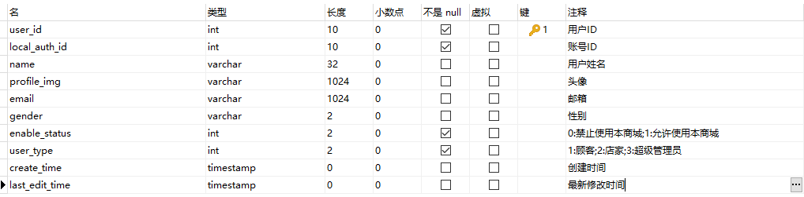

# README


[](https://github.com/GJXAIOU/O2O/blob/master/LICENSE)  

**在线阅读地址**：www.gjxaiou.com/O2O         **项目源代码见**：https://github.com/GJXAIOU/O2O

v1.1 共计 13262 词，读完预计需要 35 分钟，因为纯手码可能存在错误之处，如有疑问 Email：gjxaiou@gmail.com

> 该项目1.0 使用 SSM 框架，项目 2.0 使用将使用 SpringBoot 重新构建，将在项目 2.0 完成之后部署到阿里云服务器。该篇文档记录了项目整个方案以及构建过程中的点点滴滴，部分重要的知识点以博客的形式呈现，具体见：www.gjxaiou.com

## 零、项目预览


## 一、项目说明

- 项目描述：该项目主要实现商城后台管理，包括通用模块、数据备份模块、前端展示模块、商家模块和超级管理员模块。实现的功能有店铺、商品管理，账号管理，头条、店铺、商品等详情展示等。
- 技术架构： Spring  + SpringMVC  + MyBatis + MySQL5.5 + Redis + SUI Mobile + jQuery
- 搭建工具：Intellij IDEA2019.1.3 + Maven3.39 + Tomcat8 + Kaptcha + Linux + Lombok + Logback + Chrome
- 项目优化：通过 MySQL 主从同步实现读写分离，使用 Redis 缓存提高数据访问速度，通过 SpringMVC 拦截器实现权限认证，考虑到后期项目部署的安全问题，使用 DES 对关键配置信息进行加密和使用验证码组件 Kaptcha 实现验证码功能，并且使用脚本定时备份数据库文件和系统信息。
- 项目部署：阿里云

## 二、项目整体场景模块功能分解

- 通用模块
    - 通用 DAO 开发
    - Redis 访问层开发
    - 单元测试模块建立
- 数据备份模块
    - 搭建 MySQL 主从库

- 前端展示系统
  - 头条展示
  - 店铺类别展示
  - 区域详情展示
  - 店铺详情页开发
      - 店铺列表展示
      - 店铺名称查询
      - 店铺详情
  - 商品详情页开发
      - 商品列表展示
      - 商品名称查询
      - 商品详情
  - 搜索功能开发
  
- 商家系统模块
  - Local账号维护
  - 微信账号维护（未完成）
  - 店铺信息维护
  - 权限验证
  - 商品类别维护
- 超级管理员管理系统
  - 头条信息维护
  - 店铺类别信息维护
  - 区域信息维护
  - 权限验证
  - 店铺管理
  - 用户管理

### 实体类解析


### 各个实体类对应的属性详解

- 区域（com.gjxaiou.entity.Area.java）=》对应的表为：`tb_area`

    > 注意：各个属性的类型为包装类，因为基本数据类型会对空值进行默认赋值，会造成错误。因为默认空值就是空值。

    - ID：唯一性保证
    - 权重：权重越大，展示越靠前
    - 创建时间
    - 修改时间
    - 名称

- 用户信息（com.gjxaiou.entity.PersonInfo.java）=》

    - ID
    - 姓名
    - 头像地址
    - 邮箱
    - 性别
    - 状态：判断该用户时候有权限登录该商铺进行操作
    - 身份标识：表示用户是顾客、店家或者超级管理员

- 微信账号（com.gjxaiou.entity.WechatAuth.java）=》`tb_wechat_auth`

    - ID
    - 用户Local ID：两者进行相关联==这里直接引入 personInfo 实体类==
    - OpenID：是微信账号和公众号绑定的唯一标识
    - 创建时间

- 本地账号（com.gjxaiou.entity.LocalAuth.java）=》

    - ID
    - 用户 Local ID：==同样直接引入 PersonInfo 实体类==
    - 用户名
    - 密码
    - 创建时间

- 头条（com.gjxaiou.entity.HeadLine.java）

    - ID
    - 权重：用于展示的优先级
    - 状态：该头条是否可用， 0 表示不可用， 1 表示可用
    - 名称
    - 链接：该头条点击之后跳转的链接地址
    - 图片
    - 创建时间
    - 修改时间

- 店铺类别(com.gjxaiou.entiry.ProductCategory.java)

    - ID
    - 上级 ID：如主页面上有“美食饮品”分类，然后点击之后里面还有“奶茶”和“大排档”等等二级分类
    - 名称
    - 描述
    - 图片
    - 创建时间
    - 修改时间

- 商品详情图片（com.gjxaiou.entity.ProductImg.java）

    - ID
    - 图片地址
    - 图片显示说明
    - 图片权重
    - 创建时间
    - 商品 ID

- 商品(com.gjxaiou.entity.Product.java)

    - ID
    - 类别 ID
    - 商品名称
    - 商品描述
    - 缩略图地址
    - 商品原价
    - 商品折扣价
    - 商品对应店铺 ID
    - 商品状态：0 表示商品下架了， 1 表示在前端系统展示
    - 商品修改时间
    - 商品创建时间
    - 商品权重

## 三、数据库建表

数据库名称：`o2o`

- `tb_area`：区域信息；包括：区域 ID、区域名称、区域权重、区域创建时间、区域修改时间；==表中有唯一 key 是索引的一种的==。

    

- `tb_person_info`：用户信息；包括：用户 ID、姓名、性别、头像、邮箱、状态、身份标识、创建时间、修改时间；

    

- `tb_wechat_auth`：微信用户信息；包括：微信open id、用户id、创建时间；

- 

    

    **注意：**这里创建了主键和外键，同时对 open_id 增加了唯一索引（业务上改 key 必须唯一，性能上会通过该 key 来检索表中 WeChat 的信息，用于提高查询效能）。

    `alter table tb_wechat_auth add unique index(open_id);`

- `tb_local_auth`：本地用户信息，包括：本地用户 id，用户 id，用户名，密码，创建时间；

    **用户名必须唯一**，所以添加了唯一键。

    

- `tb_head_line`：头条，即首页轮播图；包括：ID 号、名称、图片、权重、状态、链接、创建时间、修改时间；

    

- `tb_shop_category`：店铺类别；包括：店铺类别 ID 号、名称、权重、描述、图片、上级ID、创建时间、修改时间；**通过 shopid 外键和 shop 进行关联**。

    

- `tb_product_img`：商品图片；包括：商品图片 ID、商品 ID、图片地址、图片描述、图片优先级、创建时间、修改时间；**包括主键和外键，外键使用 product_id 和 表 tb_product 进行关联。**

    

- `tb_product`：商品信息；包括：商品 ID、商品名称、商品状态、商品描述、商品缩略图、商品原价、商品折扣价、商品权重、商品创建时间、商品修改时间、商品对应类别 ID、商品对应店铺 ID；**分别和 商品类别表和店铺表是主外键的关系**。

    

- `tb_shop`：商铺信息；包括：店铺 ID、店铺名称、店铺状态、店铺描述、店铺照片、店铺联系方式、店铺地址、店铺建议、店铺权重、店铺创建时间、店铺修改时间、店铺对应的区域ID、店铺对应的类别ID、店铺对应用户ID；

- `tb_product_category`：商品类别；商品类别 ID、店铺 ID、商品类别名、商品类别描述、商品类别优先级、创建时间、修改时间；

## 四、系统环境设计

### （一）根据数据库中表格生成对应的实体类（com.gjxaiou.entity）

- `Area.java`
- `Headline.java`
- `ShopCategory.java`
- `Shop.java`
- `ProductCategory.java`
- `Product.java`
- `ProductImg.java`
- `PersonInfo.java`
- `LocalAuth.java`
- `WeChatAuth.java`

### （二）Maven 配置

- Spring 版本：`Spring 5.1.19.RELEASE`；官方文档见：[5.2.0 RELEASE Document](https://docs.spring.io/spring/docs/current/spring-framework-reference/)
- MySQL 版本：`Server version: 5.7.25-log MySQL Community Server (GPL)`
- 因为是 Demo，会经常对自己代码进行调试，使用 `junit 4.12`；
- 项目日志版本： `logback 1.2.1`（Log4j 的改良版）；
- `mysql-connectr-java`  为 8.0.17 以及 `c3p0 0.9.1.2` 连接池；
- `MyBatis 3.4.2` 依赖以及 MyBatis 与 Spring 依赖；
- Servlet 方面的以及 `stl 1.2` 以及使用` Jackson 2.9.5` 作为 JSON 解析；
- Map 工具类，对标准的 Java collection 的拓展；
- Kaptcha：用于生成验证码；
- `lombok 1.18.10` 插件：为了自己做笔记方便，因此使用 Lombok 插件；

### （三）SSM 整合验证

这里以实现区域查找功能为例，通过配置验证 SSM 配置；

- 首先是 SSM 基本配置：
    - `db.properties`  配置数据库连接信息；
    
    - `mybatis-config` 配置 MyBatis 的全局属性，包括使用 JDBC 的 getGeneratedKeys 获取数据库的自增主键值；
    
    - `spring-dao.xml` 配置整合 MyBatis  的过程，包括数据库相关参数配置文件（`db.properties`）位置，数据库连接池（数据库连接池属性， 关闭自动提交等等），配置 `SqlSessionFactory` 对象，配置扫描 Dao 接口包，实现交由 Spring 容器管理；
    
    - `spring-service.xml` 首先配置扫描 service 包下面所有使用注解的类型，然后配置事务管理器，同时配置基于注解的声明式事务；
    
    - `spring-web.xml` 配置 SpringMVC，开启 SpringMVC 的注解模式，配置静态资源位置，自定义视图解析器，文件上传解析器；
    
        上述配置完成之后，需要在 web.xml 中整合 Spring 配置。
    
    - `web.xml` 配置 DispatcherServlet，即 SpringMVC 需要加载的配置文件
- 日志配置：
  
    - 配置日志的记录级别，保存时间，输出位置，输出格式等；
    

## 五、具体模块实践

### （一）Spring 相关配置文件解析

- `spring-dao.xml`，用于Spring 整合 MyBatis 配置

    - 主要包括配置数据库相关参数 properties 的属性
- 配置数据库连接池（这里关闭了自动提交）
    - 分别配置主从数据库属性以及配置动态数据源。
    - 同时**因为需要等到 SQL 正式执行的时候才能将 DataSource 执行，所有需要配置懒加载**。
    - 配置 `SqlSessionFactory` 对象，注入数据库连接池、配置 MyBatis 全局配置文件，扫描 entity 包 以及扫描 SQL 配置文件（对应于 mapper 包下面的 `.xml` 配置文件）。
    - **最主要的就是扫描 dao 包，将相关 Bean 注入 Spring 容器中**。
    
- `spring-service.xml`

    - 配置扫描，扫描 service 包下面的注解
    - 配置事务管理器
    - 配置基于注解的声明式事务

- `spring-web.xml`：用于配置 SpringMVC

    - 首先开启 SpringMVC 注解模式
- 其次静态资源默认使用 servlet 配置，这里静态资源包括 js/gif/png/等，同时允许使用 `/` 做整体映射。
    - 自定义视图解析器，默认前缀加上路径 `/WEB-INF/html/`，后缀加上 `.html`。
    - 因为可以上传图片，所以需要配置文件上传解析器，设置默认编码以及最大上传文件大小。
    - 配置 Bean 扫描，可以扫描 `@Controller` 注解；
    - **权限拦截器**：
        - 首先是检验是否已经登录店家管理系统的拦截器
        - 其次是检验是否对店铺有操作权限的拦截器
    
- `spring-redis.xml`：用于配置 Redis

    - 首先配置加载 Redis 配置文件位置
- 然后创建 Redis 连接池，并且做相关的配置
  
    - 创建 Redis 工具类，封装好的 Redis 的连接以进行相关操作。
    
- `db.properties`

    因为使用了**主从数据库**，所有在数据库配置中分别配置了 `Master` 和 `Slave` 的访问 URL，用户名以及密码，对于数据库驱动，因为均采用 MySQL，所以采用相同的配置即可。

    ```properties
    jdbc.Driver=com.mysql.cj.jdbc.Driver
    jdbc.Master.url=jdbc:mysql://localhost:3306/o2o?useUnicode=true&characterEncoding=utf8
    jdbc.Slave.url=jdbc:mysql://localhost:3306/o2o?useUnicode=true&characterEncoding=utf8
    jdbc.Master.username=wRLCLxYhVKc=
    jdbc.Master.password=4iDT4Gbc8WALnx+m0/bAVw==
    jdbc.Slave.username=wRLCLxYhVKc=
    jdbc.Slave.password=4iDT4Gbc8WALnx+m0/bAVw==
    ```

- `mybatis-config.xml`

    因为使用了 `db.properties` 来配置数据库的相关属性，所以仅仅需要配置全局属性即可，包括使用 JDBC 的 `useGeneratedKeys` 来获取数据库自增主键值，使用列标签来替换列名，**使用驼峰命名转换**，即自动将数据库中字段为 `demo_name` 转换为程序中的属性 `demoName`。同时为了验证语句的正确性，对于每一个查询语句进行打印输出。最后，因为涉及到多个数据源，所以自定义了一个数据源动态切换插件 `DynamicDataSourceInterceptor`。

    ```xml
    <?xml version="1.0" encoding="UTF-8" ?>
    <!DOCTYPE configuration
            PUBLIC "-//mybatis.org//DTD Config 3.0//EN"
            "http://mybatis.org/dtd/mybatis-3-config.dtd">
    
    <!--因为使用了 db.properties，因此仅仅需要配置全局属性即可-->
    <configuration>
        <settings>
            <!-- 使用jdbc的getGeneratedKeys获取数据库自增主键值 -->
            <setting name="useGeneratedKeys" value="true" />
    
            <!-- 使用列标签替换列名 默认:true -->
            <setting name="useColumnLabel" value="true" />
    
            <!-- 开启驼峰命名转换:Table{create_time} -> Entity{createTime} -->
            <setting name="mapUnderscoreToCamelCase" value="true" />
            <!-- 打印查询语句 -->
            <setting name="logImpl" value="STDOUT_LOGGING" />
        </settings>
    
        <plugins>
            <plugin interceptor="com.gjxaiou.dao.split.DynamicDataSourceInterceptor"></plugin>
        </plugins>
    
    </configuration>
    ```

- `redis.properties`

    Redis 的配置同样需要主机名，端口号，最大激活线程数量，最大等待线程数量等待配置。

    ```properties
    redis.hostname=t0qC9Kba1ElI6B6IKN2BIA==
    redis.port=6379
    redis.database=0
    redis.pool.maxActive=600
    redis.pool.maxIdle=300
    redis.pool.maxWait=3000
    redis.pool.testOnBorrow=true
    ```

### （二）MyBatis 中的 SQL 语句的 mapper 文件

> 包位置：src/main/resources/mapper/

- `AreaDao.xml`：提供了区域查询语句，按照区域优先级的方式排列

    ```xml
<?xml version="1.0" encoding="UTF-8" ?>
    <!DOCTYPE mapper
            PUBLIC "-//mybatis.org//DTD Mapper 3.0//EN"
            "http://mybatis.org/dtd/mybatis-3-mapper.dtd">
    <mapper namespace="com.gjxaiou.dao.AreaDao">
        <select id="queryArea" resultType="com.gjxaiou.entity.Area">
            SELECT area_id, area_name, priority, create_time, last_edit_time
            FROM tb_area
            ORDER BY
            priority DESC
        </select>
    </mapper>
    ```
    
- `HeadLineDao.xml`

    提供头条方面的查询，包括根据传入的头条名称查询，根据头条 ID 查询，插入头条数据，更新头条数据，单个以及批量删除头条数据

    ```java
    <?xml version="1.0" encoding="UTF-8" ?>
    <!DOCTYPE mapper
            PUBLIC "-//mybatis.org//DTD Mapper 3.0//EN"
            "http://mybatis.org/dtd/mybatis-3-mapper.dtd">
    
    <mapper namespace="com.gjxaiou.dao.HeadLineDao">
    <!-- 根据传入的头条名字查询：queryHandLine-->
        <select id="queryHeadLine" resultType="com.gjxaiou.entity.HeadLine">
            SELECT  line_id,line_name,line_link,line_img, priority, enable_status, 							create_time, last_edit_time
            FROM    tb_head_line
            <where>
                <if test="headLineCondition.enableStatus!=null">
                    and enable_status = #{headLineCondition.enableStatus}
                </if>
            </where>
            ORDER BY
            priority DESC
    
        </select>
    
        <select id="selectHeadLineByIds" resultType="com.gjxaiou.entity.HeadLine" parameterType="long">
            SELECT  line_id, line_name, line_link, line_img, priority, enable_status,
            		create_time, last_edit_time
            FROM    tb_head_line
            WHERE   line_id IN
            <foreach collection="list" item="lineId" open="(" separator="," close=")">
                #{lineId}
            </foreach>
        </select>
    
        <insert id="insertHeadLine" parameterType="com.gjxaiou.entity.HeadLine" useGeneratedKeys="true"
                keyProperty="lineId" keyColumn="line_id">
    		INSERT INTO  tb_head_line
    		(line_name, line_link, line_img, priority, enable_status, create_time,
    		last_edit_time)
    		VALUES(#{lineName}, #{lineLink}, #{lineImg},
    		#{priority}, #{enableStatus}, #{createTime}, #{lastEditTime});
    	</insert>
    
        <update id="updateHeadLine" parameterType="com.gjxaiou.entity.HeadLine">
            update tb_head_line
            <!-- 注意后面的逗号 -->
            <set>
                <if test="lineName != null">line_name = #{lineName},</if>
                <if test="lineLink != null">line_link = #{lineLink},</if>
                <if test="lineImg != null">line_img = #{lineImg},</if>
                <if test="priority != null">priority = #{priority},</if>
                <if test="enableStatus != null">enable_status = #{enableStatus},</if>
                <if test="lastEditTime != null">last_edit_time = #{lastEditTime}</if>
            </set>
            where line_id = #{lineId}
        </update>
    
        <select id="selectHeadLineById" resultType="com.gjxaiou.entity.HeadLine">
            SELECT  line_id, line_name, line_link, line_img, priority, enable_status,
            		create_time, last_edit_time
            FROM    tb_head_line
            <where>
                line_id = #{lineId}
            </where>
        </select>
    
        <delete id="deleteHeadLine">
    		DELETE FROM tb_head_line
    		WHERE  line_id = #{lineId}
    	</delete>
    
        <delete id="batchDeleteHeadLine" parameterType="long">
            DELETE FROM  tb_head_line
            WHERE line_id IN
            <foreach collection="list" item="lineId" open="(" separator="," close=")">
                #{lineId}
            </foreach>
        </delete>
    </mapper>
    ```
    
- `LocalAuthDao.xml`

    因为返回结果是一个复合对象（**即返回值对应的 Java 类中包含其他类型的对象，所有需要将结果进行封装**），所以首先需要构建 `resultMap`

    ```xml
    <resultMap id="localAuthResultMap" type="com.gjxaiou.entity.LocalAuth">
    		<!-- 主键 -->
    		<id column="local_auth_id" property="localAuthId" />
    		<!--column对应库表中的字段名 property对应实体类中的属性名 -->
    		<result column="username" property="username" />
    		<result column="password" property="password" />
    		<result column="create_time" property="createTime" />
    		<result column="last_edit_time" property="lastEditTime" />
    
    		<!-- 复合对象 -->
    		<association column="user_id" property="personInfo" javaType="com.gjxaiou.entity.PersonInfo">
    			<id column="user_id" property="userId" />
    			<result column="local_auth_id" property="localAuthId" />
    			<result column="name" property="name" />
    			<result column="gender" property="gender" />
    			<result column="profile_img" property="profileImg" />
    			<result column="email" property="email" />
    			<result column="enable_status" property="enableStatus" />
    			<result column="user_type" property="userType" />
    			<result column="create_time" property="createTime" />
    			<result column="last_edit_time" property="lastEditTime" />
    		</association>
    	</resultMap>
    ```

    接下来同样需要提供插入方法、更新方法，根据用户 ID 查询方法、根据用户用户名和密码查询方式。

- `PersonInfoDao.xml`

    该部分与上面类似，同样因为查询结果的信息是复合信息，所以返回值封装为一个 resultMap。

    ```xml
    	<resultMap id="PersonInfoResultMap" type="com.gjxaiou.entity.PersonInfo">
    		<!-- 主键 -->
    		<id column="user_id" property="userId" />
    		<!--column对应库表中的字段名 property对应实体类中的属性名 -->
    		<result column="local_auth_id" property="localAuthId" />
    		<result column="name" property="name" />
    		<result column="profile_img" property="profileImg" />
    		<result column="email" property="email" />
    		<result column="gender" property="gender" />
    		<result column="enable_status" property="enableStatus" />
    		<result column="user_type" property="userType" />
    		<result column="create_time" property="createTime" />
    		<result column="last_edit_time" property="lastEditTime" />
    	</resultMap>
    ```

    这里同样提供了用户信息的查找、插入以及更新操作。

- `ProductCategoryDao.xml`

    该部分为商品类别的操作，包括根据 shopId 来查询该商铺下面的所有商品类别信息，批量新增商品列表，以及删除指定店铺下面的某个商品类别。

- `ProductImgDao.xml`：商品详情页的图片操作相关，主要包括

     * 根据店铺 Id 获取该店铺下的所有详情图片列表

       `List<ProductImg> queryProductImgList(long productId);`

     * 批量添加商品详情页图片
`int batchInsertProductImg(List<ProductImg> productImgList);`
     
     * 根据店铺 Id 删除该店铺下所有详情图片
`int deleteProductImgByProductId(long productId);`
    
- `ProductDao.xml`

    同上，因为商品的对象中包括和店铺属性、商品种类属性等信息，所以同样将返回值封装在一个 `resultMap` 中。

    ```xml
      <resultMap id="productMap" type="com.gjxaiou.entity.Product">
            <id column="product_id" property="productId"></id>
            <result column="product_name" property="productName"></result>
            <result column="product_desc" property="productDesc"></result>
            <result column="img_addr" property="imgAddr"></result>
            <result column="normal_price" property="normalPrice"></result>
            <result column="promotion_price" property="promotionPrice"></result>
            <result column="priority" property="priority"></result>
            <result column="create_time" property="createTime"></result>
            <result column="enable_status" property="enableStatus"></result>
            <result column="last_edit_time" property="lastEditTime"></result>
            <association property="productCategory" column="product_category_id"
                         javaType="com.gjxaiou.entity.ProductCategory">
                <id column="product_category_id" property="productCategoryId"></id>
                <result column="product_category_name" property="productCategoryName"></result>
            </association>
            <association property="shop" column="shop_id"
                         javaType="com.gjxaiou.entity.Shop">
                <id column="shop_id" property="shopId" />
                <result column="owner_id" property="ownerId" />
                <result column="shop_name" property="shopName" />
            </association>
            <!--TODO：为什么这里的 column 是 product_id-->
            <collection property="productCategoryList" column="product_id"
                        javaType="com.gjxaiou.entity.ProductImg">
                <id column="product_img_id" property="productImgId" />
                <result column="img_addr" property="imgAddr" />
                <result column="img_desc" property="imgDesc" />
                <result column="priority" property="priority" />
                <result column="create_time" property="createTime" />
                <result column="product_id" property="productId" />
            </collection>
        </resultMap>
    ```

    另外提供了根据 Id 查询商品的 `queryProductByProductId()` 方法，查询商品总数的 `queryProductCount()` 方法，插入商品的 `insertProduct()` 方法，更新商品信息的 `updataProduct()` 方法，删除商品的 `deleteProduct()` 方法。

- ShopCategoryDao.xml

    暂时只提供了店铺种类的查询操作，其他的删除以及更新操作将在 2.0 版本中实现。

- ShopDao.xml

    同样，因为 Shop 类中封装了其他对象，所有其返回结果为 `resultMap`。
  
  ```xml
      <resultMap id="shopMap" type="com.gjxaiou.entity.Shop">
          <id column="shop_id" property="shopId"></id>
          <result column="owner_id" property="ownerId" />
          <result column="shop_name" property="shopName" />
          <result column="shop_desc" property="shopDesc" />
          <result column="shop_addr" property="shopAddr" />
          <result column="phone" property="phone" />
          <result column="shop_img" property="shopImg" />
          <result column="priority" property="priority" />
          <result column="create_time" property="createTime" />
          <result column="last_edit_time" property="lastEditTime" />
          <result column="enable_status" property="enableStatus" />
          <result column="advice" property="advice" />
          <!-- property 对应类中属性值，column 为该属性值对应的数据库中字段，JavaType 表示该属性类型 -->
          <association property="area" column="area_id" javaType="com.gjxaiou.entity.Area">
              <id column="area_id" property="areaId"></id>
              <result column="area_name" property="areaName"></result>
          </association>
          <association property="ower" column="user_id"
                       javaType="com.gjxaiou.entity.PersonInfo">
              <id column="user_id" property="userId"></id>
              <result column="name" property="name"></result>
          </association>
          <association property="shopCategory" column="shop_category_id"
                       javaType="com.gjxaiou.entity.ShopCategory">
              <id column="shop_category_id" property="shopCategoryId" />
              <result column="shop_category_name" property="shopCategoryName" />
          </association>
      </resultMap>
  
  ```
  
  提供的功能包括：
  
  - 根据店铺 ID 查询店铺：`queryByShopId()`；
  
  - 查看并返回与该店铺状态相同的店铺数：`queryShopCount()`；
  
  - 新增店铺：`insertShop()`；
  
  - 更新店铺：`updateShop()`；
  
  - 分页查询所有店铺：`queryShopList()`；
  
      

### （二）工具类

工具类封装了一系列项目中一系列的常用方法，主要包括以下部分：

- `CodeUtil`

    实现验证码的验证功能，因为这里通过 Google 的 kaptcha 来实现验证码的功能。主要逻辑为：将 key 为 `KAPTCHA_SESSION_KEY` 的验证码字符串放入 Session 中，然后使用 `request.getSession().getAttribute()`来获取返回值，该值与 request 请求中 key `verifyCodeActual` 中保存的真实值进行对比来判断输入的验证码是否正确。

    ```java
    package com.gjxaiou.util;
    
    import javax.servlet.http.HttpServletRequest;
    
    /**
     * @author GJXAIOU
     * @create 2019-10-19-14:30
     */
    public class CodeUtil {
        public static boolean checkVerifyCode(HttpServletRequest request) {
            String verifyCodeExpected = (String) request.getSession().getAttribute(
                    com.google.code.kaptcha.Constants.KAPTCHA_SESSION_KEY);
            String verifyCodeActual = HttpServletRequestUtil.getString(request,
                    "verifyCodeActual");
            if (verifyCodeActual == null
                    || !verifyCodeActual.equalsIgnoreCase(verifyCodeExpected)) {
                return false;
            }
            return true;
        }
    }
    
    ```

- `DESUtil`

    这里使用对称加密算法 DES 来对数据库配置信息进行加密处理，流程为：首先设置秘钥 key 以及字符编码和指定采用的加密算法名称。在初始化阶段生成 DES 算法对象，运行 SHA1 安全策略，同时设置上密钥种子并生成秘钥对象。

    加密过程：将未加密的字符串传入 `getEncryptString()` 方法，首先将字符串转换为字符数组，然后获取加密对象和初始化密码信息，然后调用 `doFinal()` 方法来进行加密，最后将加密之后的字符数组转换为字符数组返回。

    解密过程：解密过程与上面一样，只不过输入的字符串为加密之后的信息，因为对称加密的加密和解密秘钥是一样的，所以步骤和上面类似。 

- `ImageUtil`

    因为项目中涉及到大量的图片处理，所以封装了一个工具类来集中处理。首先处理之前要获得图片的绝对路径，这里为了防止用户上传重复名称的文件，使用系统生成的随机数（由当前时间和五位随机数共同组成）。同时使用了 `Thumbnails` 中的 `watermark`方法为图片增加了水印。以及删除图片等等操作。

- `PageCalculator`

    该部分是用于在数据查询过程中需要分页的情况，通过传入第几页以及每页显示多条数据来计算应该查询到多少行。

    ```java
    package com.gjxaiou.util;
    
    /**
     * @author GJXAIOU
     * @create 2019-10-24-16:37
     */
    public class PageCalculator {
        public static int calculateRowIndex(int pageIndex, int pageSize) {
            return (pageIndex > 0) ? (pageIndex - 1) * pageSize : 0;
        }
    }
    ```


==实现模块步骤==

- 步骤一：商家模块

    - 先实现店铺的增删改查

        - 店铺注册

            主要学习目标包括：连接数据库， MyBatis 数据库表映射关系的配置， dao ->service ->controller 层代码编写以及 Junit 的使用。Session以及图片处理工具 Thumbnailator 使用， suiMobile 前端设计与开发。

    - 然后实现商品的增删改查


## 六、具体模块分析

### （一）前端展示模块

这里的前端代码不做展开介绍，部分组件采用了阿里巴巴共享业务事业部 UED 团队开发的轻量级 [SUI Mobile](https://sui.ctolog.com/)，通过 UI 库进行搭建，同时部分前端代码需要自己针对性的书写，主要包括以下部分页面。

- 头条展示
- 店铺类别展示
- 区域详情展示
- 店铺详情页开发
- 搜索功能开发

### （二）商家模块

- 账号维护
- 店铺信息维护
- 权限验证
- 商品类别维护

#### 1.针对商品信息以及类别的维护

主要实现目标：商品的增删改查功能。

**具体分析**

- DAO 层

    包括 `com.gjxaiou.dao.ProductDao.java`,`com.gjxaiou.dao.ProductImgDao.java`

    - 商品的查询功能

        - 根据 ID 查询：`Product queryProductByProductId(Long productId);`

        - 分页查询：

            ```java
            List<Product> queryProductList(@Param("productCondition") Product productCondition, @Param("rowIndex") int rowIndex,@Param("pageSize") int pageSize);
            ```

        - 查询总数：`int queryProductCount(@Param("productCondition") Product productCondition);`

    - 商品的新增功能：`int insertProduct(Product product);`

    - 商品的更新修改功能：`int updateProduct(Product product);`

    - 商品的删除功能：`int updateProductCategoryToNull(long productCategoryId);`

    - 获取店铺下面所有详情图片：`List<ProductImg> queryProductImgList(long productId);`

    - 批量添加商品详情页的图片：`int batchInsertProductImg(List<ProductImg> productImgList);`

    - 根据店铺 ID 删除店铺下所有详情图：`int deleteProductImgByProductId(long productId);`

- Mapper：主要包括文件为：`ProductDao.xml` 和 `ProductImgDao.xml`和 `ProductCategoryDao.xml`

- Service 层以及实现

    分别提供了接口：`com.gjxaiou.service.ProductService.java`、`com.gjxaiou.service.ProductCategoryService.java` 以及对应的实现类 `com.gjxaiou.service.impl.ProductServiceImpl.java` 和 `com.gjxaiou.service.impl.ProductCategoryServiceImpl.java`。

    首先针对 `ProductService.java` 和 `ProductServiceImpl.java`
    
    - `getProductById`方法直接调用 Dao 中的查询方法即可；
    - `getProductList` 方法实现分页获取商品列表；
    - `addProduct` 方法实现添加商品信息和对应的图片的处理；
        - 步骤一：处理缩略图，获取缩略图的相对路径并赋值给 Product；
        - 步骤二：向 tb_product 中写入商品信息，同时获取 productId；
        - 步骤三：结合 productId 批量处理商品详情图；
        - 步骤四：将商品详情图列表批量插入 tb_product_img 中；
    - `modifyProduct` 方法实现修改商品信息与图片处理
        *     步骤一：如果缩略图参数有值，则处理缩略图
        *     步骤二：若原来存在缩略图则先删除再添加新的缩略图，之后获取缩略图相对路径并赋值给 product
        *     步骤三：若商品详情图列表参数有值，对商品详情图片列表进行同样的操作
        *     步骤四：将 tb_product_img下面的该商品原来的商品详情图记录全部清除
        *     步骤五：更新 tb_product_img 以及 tb_product 的信息
    
    其次针对 ``ProductCategoryService.java` 和 `ProductCategoryServiceImpl.java` 来说，用于处理商品类别。
    
    - `getProductCategoryList` 方法用于获取该店铺中所有的商品类别，直接调用 Dao 层的查询语句，传入 shopId 之后就可以得到该店铺中所有的商品类别。
    - `batchAddProductCategory` 方法用于批量增加商品类别，也是直接调用 Dao 层的批量插入来实现的。
    - `deleteProductCategory` 反复用于删除某个商铺中的指定商品类别。
        - 步骤一：将该商品类别下面的所有商品的商品属性值置为 NULL；
        - 步骤二：调用 Dao 层直接将该商品属性删除。
    
- Controller 层

    主要包括 `com.gjxaiou.web.shopadmin.ProductManagerController.java` 和 `com.gjxaiou.web.shopadmin.ProductCategoryManagerController.java`

    - `addProduct()` 对应的请求路径就是 `/shopAdmin/addProduct`，当然因为是添加商品，所有需要有上传的数据，因此使用 POST 请求。

        ```java
         @RequestMapping(value = "/addProduct", method = RequestMethod.POST)
         @ResponseBody
        public Map<String, Object> addProduct(HttpServletRequest request) throws ProductOperationException {
        ```

        - 步骤一：判断验证码是否输入正确；
        - 步骤二：获取前端参数的变量初始化，包括商品、缩略图、详情图列表实体类；通过封装的 `HttpServletResquestUtil`来获取 key 为 `productStr` 的商品，同时因为可能涉及到新增图片，所以使用 `CommonsMultipartResolver` 来判断请求中是否存在文件流，如果存在文件流则取出相关的文件（包括缩略图和详情图）。
        - 步骤三：获取前端传过来的表单 String 流，并将其转换为 Product 实体类，这里使用的是 `ObjectMapper` 类的 `readValue()` 方法，它实现了 `Serializable` 接口，所以相当于是一种反序列化。
        - 步骤四：如果 Product 对象信息、缩略图、详情图等信息均不为空则进行商品添加操作。

    - `getProductById` 实现了通过商品 ID 来获取商品信息，请求路径为：`/shopAdmin/getproductById`，这里使用的 GET 请求。

        - 步骤一：根据传入的商品 Id 来通过 Service 层 的 `productService` 的 `getProductById` 来获取商品 Product；

        - 步骤二：然后同理可以获取该商品所在店铺中所有的商品类别。

        - 步骤三：将获取到的 Product 以及 ProductCategoryList 分别放入视图 Map 中返回。

            ```java
            modelMap.put("product", product);
            modelMap.put("productCategoryList", productCategoryList);
            modelMap.put("success", true);
            ```

    - `modifyProduct` 实现了对店铺信息的修改，请求路径为：`/shopAdmin/modifyProduct`，使用的是 POST 请求。

        - 步骤一：判断商品状态（从 request 中的 `statusChange`字段获取）和验证码是否正确。

        - 步骤二：接收前端参数变量初始化，包括商品、缩略图、详情图列表，同时如果请求中存在文件流则取出相关文件

            ```java
            CommonsMultipartResolver multipartResolver=new CommonsMultipartResolver(request.getSession().getServletContext());
             // 若请求中存在文件流，则取出相关的文件
                    try {
                        if (multipartResolver.isMultipart(request)) {
                            thumbnail = handleImage(request, productImgList);
                        }
            ```

        - 步骤三：同样从提交表单的 String 流中，通过 key ：`productStr` 取出商品对象并且转换为实体类。

        - 步骤四：如果 Product信息、缩略图以及详情图里都不为空，则开始进行商品添加操作

    - `getProductListByShop`，根据店铺获取该店铺下所有的商品分类，访问路径为：`/shopAdmin/getProductListByShop`，请求为 GET 请求。

        - 步骤一：首先通过 `HttpServletRequestUtil.getInt(request, key)` ，这里的 key 分别为 pageIndex 和 pageSize ，即获取前台传过来的页码以及每页要求返回的商品数量。
        - 步骤二：通过 `(Shop)request.getSession().getAttributes("currentShop") ` 来获取店铺信息，以及通过 HttpServletRequestUtil 来获取传入的检索辅助条件。
        - 步骤三：判断上面条件符合之后调用 Service 来处理并返回结果。
        - 步骤四：将返回结果作为 value（每个 value 添加对应的 key），放入视图中返回。

    `com.gjxaiou.web.shopadmin.ProductCategoryManagerController.java` 里面的方法类似，省略。

#### 2.针对店铺信息与类别维护

##### 2.1 实现目标：

- 实现单个店铺信息的获取；
- 实现对店铺信息进行修改；

##### 2.2 获取店铺信息

- DAO 层

    对应于 `com.gjxaiou.dao.ShopDao.java` ；其中提供的方法包括：

    - 通过 shopId 查询店铺：`Shop queryByShopId(long shopId);`

    - 返回与该店铺状态相同的店铺数：`int queryShopCount(@Param("shopCondition") Shop shopCondition);`

    - 新增店铺：`int insertShop(Shop shopDao);`

    - 更新店铺：`int updateShop(Shop shop);`

    - 带分页功能的查询商铺列表：
    
        ```java
         /**
             * 带有分页功能的查询商铺列表 。 可输入的查询条件：商铺名（要求模糊查询） 区域Id 商铺状态 商铺类别 owner
             * (注意在sqlmapper中按照前端入参拼装不同的查询语句)
             * @param shopCondition
             * @param rowIndex：从第几行开始取
             * @param pageSize：返回多少行数据（页面上的数据量）
             *                    比如 rowIndex为1,pageSize为5 即为 从第一行开始取，取5行数据
             */
            List<Shop> queryShopList(@Param("shopCondition") Shop shopCondition,
                                     @Param("rowIndex") int rowIndex,
                                     @Param("pageSize") int pageSize);
        ```
    
        这里的 SQL 语句中，需要对输入的条件（shopCondition 中 shop 的各种属性）进行判断，因此使用 `<where></where>` 标签配合 `<if></if>`使用，进行动态 SQL 拼接，同时最后使用 ：`LIMIT #{rowIndex},#{pageSize}`进行分页。同时因为返回值为 shop对象（里面包含了其他的对象），因此采用 resultMap，里面通过组合 `<association> </association>`来实现 实体类和 数据表之间的映射；
    
        对应到 Service 层中，因为用户传入的参数肯定是查看第几页和每页显示几条（pageIndex 和 pageSize），一次这里通过一个工具类：PageCalculator，通过：`rowIndex = (pageIndex - 1) * pageSize;`来计算从第几条开始显示；
    
    对于 `com.gjxaiou.dao.ShopCategoryDao.java`  来说，提供了对店铺种类的操作，包括
    
    - `queryShopCategory` 方法是根据店铺类别 Id 来获取店铺类型列表，因为店铺类别是有等级的，如果参数为空的话则表示一级店铺类型，反之则是二级等子集店铺类型。
        - 首页展示一级目录（即 parent_id 为 null 的店铺类别）
        - 点进去某个一级目录加载对应目录下的子目录；
        - 店铺只能挂在店铺二级类别下；
        - 在首页点击某个一级店铺目录，进入店铺展示页面的时候，需要加载对应目录下的子目录。
    - `batchInsertProductCategory` 方法是批量新增商品类别；
    - `deleteProductCategory` 方法作用是删除指定商品 Id 的商品类别；
    - `insertShopCategory` 方法作用是新增商品分类；
    - `updateShopCategory`方法作用是修改商品分类；
    - `selectShopCategoryById` 方法作用是根据 Id 来查询商品分类信息；
    
- Mapper：对应的 Mapper 为 `ShopMapper.xml`；

- Service 层

    ==在 写Service 层之前，一般先定义 dto，因为操作店铺返回值不仅仅包括 shop 类，同样包括一些状态信息，然后返回给 controller 层处理，因此需要 dto 类，dto 中的返回状态值是使用枚举类型来保存的==

    提供接口：`com.gjxaiou.service.ShopService.java`：增加店铺；更新店铺信息（包括对图片的处理）； 通过店铺 Id 获取店铺信息；根据店铺的状态进行分页查询。

    提供接口2：`com.gjxaiou.service.shopCategoryService.java`：按照查询条件获取店铺类别分页列表，新增商品分类，修改商品分类，根据 id 查询商品分类信息。

    具体地实现类：`com.gjxaiou.service.impl.ShopServiceImpl.java`

    - `getByShopId()` ，调用对应的 Dao 来实现。

    - `addShop()`，因为是新增操作，所以使用了 `@Transactional` 注解来实现事务处理。

        - 步骤二：调用 Dao 层的 `shopDao` 的 `insertShop(shop)` 来实现插入店铺，通过判断返回值（即影响行数）来判断是否是否插入成功，如果插入不成功则回滚。

            ```java
             // 插入并检查店铺是否新增成功
            int effectNum = shopDao.insertShop(shop);
            if (effectNum <= 0){
                // 只有抛出 RuntimeException 事务才能回滚
                throw new ShopOperationException("店铺新建失败");
                
            // 该异常本质上是继承了 RuntimeException
            public class ShopOperationException extends RuntimeException{
                private static final long serialVersionUID = 7923277044845362315L;
                public ShopOperationException(String msg){
                    super(msg);
                }
            }    
            ```

        - 然后将图片插入店铺中，然后更新店铺信息，同样这里和上面一样加上事务处理。

        - ==**使用注解实现控制事务的优点**==：

            - 开发团队达成一致性约定，明确标注事务方法的编程风格；
            - 保证事务方法的执行时间尽可能短，不要穿插其他网络操作，RPC/HTTP 请求或者剥离到事务方法外部；
            - 不是所有的方法都需要事务，如只有一条修改操作、只读操作时不需要事务控制；
        
    - `modifyShop()`，修改店铺信息
      
        *      首先更新店铺图片：根据参数 shop 中的 shopId 获取原来店铺对应的图片，删除，再添加新的图片信息，最后更新店铺
    *      `getShopList()`，分页显示店铺查询结果。直接调用 Dao 层的 `shopDao.queryShopList()` 实现。

    另一个对应的具体实现类：`com.gjxaiou.service.ShopCategoryServiceImpl.java`

    - `getShopCategoryList` 方法获得店铺的分类，==这里使用了 Redis==。

        - 这里统一定义了 Redis 的 key 前缀为：`shopCategoryList`，==这里使用了 JackSON 的 ObjectMapper 类来讲数据转换为操作类==。

        - 步骤一：首先判断传入的查询条件是否为空，如果为空则将 Redis 的 key 拼接为 `shopCategoryList_allFirstLevel`，相当于列出 parentId 为空的店铺类型，即列出所有首页大类。则将 Redis 的 key 拼接为：`shopCategoryList_parent+父类别Id`。

        - 步骤二：使用 `jedisKeys.exist(key)` 来判断该 key 是否存在，如果不存在则从数据库中取出数据，即调用 Dao 层的 ` shopCategoryDao.queryShopCategory()` 来实现。然后将返回的结果使用 ObjectMapper  类的 `writeValueAsString()` 方法来讲实体类集合转换为 String 存入 Redis。如果该 key 存在，直接使用 `get(key)` 方法从 Redis 中取出数据，因为返回值是一个集合类型，而直接从 Redis 中取出的数据是 String 类型，所以使用 ObjectMapper 类的 `getTypeFactory()` 得到转换之后类型为 ArrayList 集合类型，最后使用 `readValue()` 读取出值。

            ```java
            // 若存在，则直接从redis中取出数据
            String jsonString = jedisStrings.get(key);
             // 将String转换为集合类型
                        JavaType javaType = mapper.getTypeFactory().constructParametricType( ArrayList.class,  ShopCategory.class);
                        try {
                            shopCategoryList = mapper.readValue(jsonString, javaType);
            ```

    - `addShopCategory` 增加店铺种类，直接调用 `shopCategoryDao.insertShopCategory()` 来插入，如果插入成功之后将需要将该 key 对应的 Redis 缓存清理，因为这时候的缓存已经失效了。

        ```java
         int effectNum = shopCategoryDao.insertShopCategory(shopCategory);
         if (effectNum <= 0) {
            throw new ShopCategoryOperationException(ShopCategoryStateEnum.EDIT_ERROR.getStateInfo());
           } else {
                  // 删除缓存信息
                  cacheService.removeFromCache(SC_LIST_KEY);
                   }
        ```

    - `modifyShopCategory` 同理，在调用 Dao 层的 `shopCategoryDao.updateShopCategory();` 如果修改成功同样要删除 Redis 中的缓存信息。

- Controller 层

    这里对应的 Controller 层一共包括三个：`com.gjxaiou.web.frontEnd.ShopDetailController.java` ， `com.gjxaiou.web.frontEnd.shopListController.java` 以及 `com.gjxaiou.web.shopadmin.shopManagerController.java` 。

    首先是 `com.gjxaiou.web.frontEnd.shopDetailController.java`

    - `listShopDetailPageInfo` 方法用于获取店铺信息以及店铺下的信息商品类别信息。访问路径为：`/frontEnd/listShopDetailPageInfo`。使用 GET 请求。
        - 步骤一：从 request 中根据 key 为 `shopId` 取出店铺 ID ，然后调用 `shopService.getByShopId(shopId)` 获取店铺，以及通过 `productCategoryService.getProductCategoryList` 获取商品种类类别。
        - 步骤二：将查询得到的值放入返回视图中返回。
    - `listProductsByShop` 方法用户根据 ShopId 来获取商品列表，这里使用分页查询显示，所以从 GET 请求中根据 key 得到开始页面下标和每页显示页数以及 shopId，最后调用 `productService.getProductList` 来查询结果，最后将结果放入 modelMap 中返回。
    - `compactProductCondition4Search` 方法实现组合查询条件，可以查询的条件为 `long shopId, long productCategoryId, String productName`。
        - 步骤一：首先创建一个 Shop 对象，然后使用 set 方法将参数中的值赋值给对应的属性，，同样需要创建一个 ProductCategory 对象然后赋值。

    其次是 `com.gjxaiou.web.frontEnd.ShopListController.java`

    - `listShopsPageInfo` 方法是返回商品列表的一级或者二级区域信息列表，访问路径为：`/frontEnd/listShopsPageInfo`，首先取出 GET 请求中 key 为 `parentId`的值，如果该值存在就取出所有的二级列表，则新建一个 ShopCategory 对象，然后赋值调用 ` shopCategoryService.getShopCategoryList()` 进行查询，然后返回即可，如果 `parentId` 不存在，则将查询条件设置为 parentId = null 即可。
    - 其他方法类似不在展开。

    针对 `com.gjxaiou.web.shopadmin.shopManagerController.java`

    - `registerShop`  方法实现店铺注册功能。==可以着重理解这里==

        - 这里的  request 这是前端传入的 HttpServletRequest 类型参数 request，表示客户端的请求。客户端通过 HTTP 协议访问服务器的时候，其请求头中的信息都封装在该对象中，可以通过该对象提供的方法获取客户端请求的所有信息。本方法中，当用户在注册店铺的页面中填写完店铺信息后，完整的店铺信息就会封装保存在 request 参数中；
        - 因为是注册店铺，所以提交的信息较多，所以使用 POST 方法。

        ```java
        @RequestMapping(value = "/registerShop", method = RequestMethod.POST)
        @ResponseBody
        private Map<String, Object> registerShop(HttpServletRequest request) {
                Map<String, Object> modelMap = new HashMap<>();
            }
        ```

        整体的流程是：

        - 步骤一：读取请求中的信息（包括店铺信息以及图片信息）然后转换为实体类对象，即接收并且转换响应的参数，**获取信息还是使用 key - value 的格式**，示例：

            ```java
            // 这里的 shopStr 是与前端约定好的，以此为 key，然后得到其 value 值
            String shopStr = HttpServletRequestUtil.getString(request, "shopStr");
            // 这里使用的是 Jackson 的方法 ，具体见：https://github.com/FasterXML/jackson-databind
            ObjectMapper mapper = new ObjectMapper();
            Shop shop = null;
            try {
                // 将转换后的 shopStr，转换为 shop 实体类；
                shop = mapper.readValue(shopStr, Shop.class);
            } catch (JsonParseException e) {
                // 转换失败之后，将错误和错误信息返回前端
                modelMap.put("success", false);
                modelMap.put("errMsg", e.getMessage());
                return modelMap;
            ```

        - 步骤二：如果转换为实体类成功之后，首先处理店铺图片，具体流程见下：

            ```java
            // 3.处理店铺图片（使用 spring 自带的 CommonsMultipartFile）
            CommonsMultipartFile shopImg = null;
            // 文件解析器，解析 request 中的文件对象，即从 request 的本次回话的上下文获取文件内容
            CommonsMultipartResolver multipartResolver =
                new CommonsMultipartResolver(request.getSession().getServletContext());
            // 判断 request 是不是有上传的文件流，如果有则将 request 转换为 MultipartHttpServletRequest 对象
            if (multipartResolver.isMultipart(request)) {
                MultipartHttpServletRequest multipartHttpServletRequest = (MultipartHttpServletRequest) request;
                // 从该对象中提取文件流，同时强制转换为 spring 能够处理的文件流，shopImg 同前端一致
                shopImg = (CommonsMultipartFile) multipartHttpServletRequest.getFile("shopImg");
            } else {
                modelMap.put("success", false);
                modelMap.put("errMsg", "上传图片不能为空");
                return modelMap;
            }
            ```

        - 步骤三：正式开始注册店铺，注册之前首先从 Session 中取出传入的信息

            ```java
            // 通过从 session 中获取登录信息，得到店主信息，因为注册店铺之前必须先登录，登录时将登录信息以键值对的形式存储，这里 user 即为 key
            PersonInfo owner = (PersonInfo) request.getSession().getAttribute("user");
            owner.setUserId(1L);
            shop.setOwner(owner);
            ```
            
    
    然后根据这些信息调用 `shopService.addShop()` 来实现正式的插入店铺。
    
- `modifyShop` 方法作用是修改店铺信息，当然使用的是 POST 请求。
  
        - 步骤一：判断用户的验证码是否正确；
        - 步骤二：从 request 中取出 key 为 shopStr 的店铺信息字符串，然后使用 Jackson 的 ObjectMapper 类的 readValue 方法将其转换为 Shop 实体类。
        - 步骤三：同上面方法处理店铺图片；
        - 步骤四：修改店铺信息，直接调用 `shopService.modifyShop()` 方法来处理。然后将 key 为 success 的视图返回。

#### 3.针对区域信息与操作

- Dao 层

    因为区域一层原则上只有超级管理员有权限，因此在 1. 0 版本中仅仅提供了查询方法，将在后续 2.0  版本中提供新增、修改和删除对应的方法。

    `com.gjxaiou.dao.AreaDao.java`

    ```java
    package com.gjxaiou.dao;
    
    
    import com.gjxaiou.entity.Area;
    
    import java.util.List;
    
    /**
     * @author GJXAIOU
     * @create 2019-10-29-21:53
     */
    public interface AreaDao {
        /**
         *  列出所有的区域列表
         * @return
         */
        List<Area> queryArea();
    }
    
    ```

- Service 层

    同样，Service 层仅仅提供一个接口，在 `impl` 包下面仅仅提供一个实现类，仍然仅仅提供查询功能。

    `com.gjxaiou.service.AreaService.java`

    ```java
    package com.gjxaiou.service;
    
    import com.gjxaiou.entity.Area;
    
    import java.util.List;
    
    /**
     * @author GJXAIOU
     * @create 2019-10-31-16:06
     */
    public interface AreaService {
        String AREA_LIST_KEY = "areaList";
        List<Area> getAreaList();
    }
    
    ```

    对应的实现类为：`com.gjxaiou.service.impl.AreaServiceImpl.java`，因为是查询方法，所以==借助 Redis==。

    由上面的接口可以看出其中定义了一个 key 为 `    String AREA_LIST_KEY = "areaList";`，所以第一步就是判断 Redis 中是否存在该 Key，如果不存在则使用 `areaList = areaDao.queryArea();` 来从数据库中获取区域列表，然后还是使用 Jackson 的 ObjectMapper 类中的 `writeValueAsString()` 来将查询得到的列表 list 转换为 String 类型。**然后将 key 和查询得到并转换为 String 类型的结果插入 Redis 中。**并将列表格式的结果返回。

    如果 Redis 中存在该 key，既可以通过 `JedisUtil` 中的 `Strings` 类型对象的 get 方法获取查询结果（结果为 String 类型）。然后使用 ObjectMapper 类中的 `readValue()` 方法将其转换为 List 类型。

    ```java
    // 将String转换为List
    String jsonString = jedisStrings.get(key);
    JavaType javaType = mapper.getTypeFactory().constructParametricType(ArrayList.class, Area.class);
    try {
        areaList = mapper.readValue(jsonString, javaType);
    } 
    ```

- Controller 层

    Controller 层也就只有一个方法：`listArea()`，对应的访问路径为：`/superAdmin/listArea`。

    ```java
     /**
         * 这里含义是使用 SpringMVC 作用域进行传值，这里使用的是 Map 集合（其他方式见总结笔记），本质上是将 Map 集合放入 Request 作用域
         *    然后 Spring 会将 map 集合通过 BindingAwareModelMap 类进行实例化；
         * 因为这是 Controller 返回值满足 key-value 格式，即返回值为对象或者 map 格式，使用 @ResponseBody 会使其恒不跳转，
         *    同时会自动将响应头设置为： application/json;charaSet=utf-8,且转换后的内容以输出流的形式返回到客户端；
         * @return Map
         */
        @ResponseBody
        @RequestMapping(value="/listArea", method = RequestMethod.GET)
        public Map<String,Object> listArea(){
    ```

    具体执行过程就是直接调用 `areaService.getAreaList();`，然后将返回结果放入 Map 中返回即可。


## 七、补充

### （一）使用 DTO 原因

DTO(data transfer object)：数据传输对象，以前被称为值对象(VO,value object)，作用仅在于在应用程序的各个子系统间传输数据，在表现层展示。与 POJO 对应一个数据库实体不同，DTO 并不对应一个实体，可能仅存储实体的部分属性或加入符合传输需求的其他的属性。																


### （二）验证码功能使用说明
 - 导包 Kaptcha
 - web.xml 中使用servlet 生成验证码的相关设置
 - shopOperation.html 中引入验证码控件
 其中控件中有点击方法，点击就换一张验证码图片，因此使用 js/common/common.js 实现，然后在 shopoperation.js
    中将生成的验证码传入，最后在 shopOperation.HTML 中引入上面的 js
  
- 同样后端实现方法 CodeUtil.java 实现判断验证码是否正确  ;
- 最后在 ShopManagerController.java  的添加店铺之前进行验证


### （三）图片处理工具 thumbnailator 使用说明
1. 导包
2. util包下面添加 ImageUtil 方法
该方法中实现了图片的一般操作方法，这里的方法可以自定义。但是如果是批量处理图片，需要平凡的获取图片文件路径，
因此新建一个 PathUtil.java 类，里面实现获取输入文件路径和输出文件路径；

### （四）数据库实现主从读写分离

#### 1.数据库配置
MySQL 的主从复制功能不仅可以实现数据的多处自动备份，从而实现数据库的拓展。同时多个数据备份不仅可以加强数据的安全性，同时通过读写分离还能进一步提升数据库的负载性能。

在一主多从的数据库体系中，多个从服务器采用异步的方式更新主数据库的变化，**业务服务器在执行写或者相关修改数据库的操作是在主服务器上进行的，读操作则是在各从服务器上进行**。如果配置了多个从服务器或者多个主服务器又涉及到相应的负载均衡问题，关于负载均衡具体的技术细节还没有研究过，本项目中实现一主一从的主从复制功能，一主多从的复制和读写分离的模型见下：


- **主从同步工作过程：**

首先主服务器（Master）对数据的操作记录到二进制日志（Binary log）文件中（即在每个事务的更新事件完成之前，Master 在日志中都会记录这些改变，MySQL 串行的将事务写入二进制文件中，写入完成之后 Master 通知存储引擎提交事务），然后从服务器（Slave）开启一个 IO 线程保持与主服务器的同步，如果发现 Master 二进制日志文件发生改变， 将 binary log 拷贝然后写入从服务器的中继日志（ Relay log）中，即将主服务器的操作同步到 Relay log  中，最后从服务器重新开启一个 SQL线程，将刚才同步过来的操作在从服务器中进行执行，从而实现从数据库和主数据库的一致性，也实现了主从复制。


**具体配置：**
一共使用两台虚机实现数据库的读写分离，虚机一：CentOS7Mini：192.168.238.136，为主数据库，虚机二：CentOS7MiniClone：192.168.238.135，为从数据库；

*   主服务器：
    *   开启二进制日志
    *   配置唯一的 server-id
    *   获得 master 二进制日志文件名及位置
    *   创建一个用于 slave 和 master 通信的用户账号
*   从服务器：
    *   配置唯一的 server-id
    *   使用 master 分配的用户账号读取 master 二进制日志
    *   启用 slave 服务


- 虚拟机一：Master 主机
  - 修改 `/etc/my.cnf` 中配置 ，然后重启数据库：`service mysqld restart`

```linux
server-id=1 # 设置 server-id
log-bin=master-bin # 开启二进制文件
log-bin-index=master-bin.index
```
- 然后进入 MySQL：
```mysql
create user 'repl'@'192.168.238.135' identified by 'GJXAIOU_o2o'; # 创建主从直接的通信账号
grant replication slave on *.* to 'repl'@'192.168.238.135';# 授予该账号读取主服务器中所有数据库的所有表的权限
```
- 然后重启数据库 ：`sudo service mysqld restart`
- 然后进入 MySQL：
```mysql
flush privileges;
show master status; # 查看二进制日志文件状态
```
这里结果如下：
```mysql
+----------+----------+--------------+------------------+-------------------+
| File  | Position | Binlog_Do_DB | Binlog_Ignore_DB | Executed_Gtid_Set |
+--------+----------+--------------+------------------+-------------------+
| master-bin.000002 |     1265 |          |              |                 |
+-------------+----------+------------+----------------+----------------+
1 row in set (0.00 sec)
```
- 注：如果配置错误，则可以在 mysql 中删除用户：`drop user 'repl'@'192.168.238.135'` 


- 虚拟机二中同样配置
  - 首先修改 `/etc/my.cnf`
```linux
server-id=2
relay-log-index=slave-relay-bin.index
relay-log=slave-relay-bin
```
- 从库重启 mysql 之后，打开 mysql 回话，执行下面语句；
```mysql
CHANGE MASTER TO  MASTER_HOST='192.168.238.136',master_post=3306,master_user='repl',master_password='GJXAIOU_o2o',master_log_file='master-bin.000002',master_log_pos=1265;
```
访问主库的IP地址，从 3306端口访问，使用 repl 账号，密码是 GJXAIOU_o2o，读取的文件是 `master-bin.000002`，从 1265 位置开始读取；

- 开启主从跟踪和查看从库状态
```mysql
start slave; # 开启主从跟踪
show slave status \G; # 查看从库状态
```

- 可以使用 `stop slave`关闭主从跟踪；

**补充：设置还原**
当设置有问题的时候可以使用还原设置来重新配置；

- 主库设置还原：`reset master;`
- 从库设置还原：`reset slave all;`


**补充：从 Windows 导入数据库到 CentOS 中**
- 首先将 Windows  的数据库导出
cmd 中使用：`mysqldump -u用户名 -p 数据库名 数据表名 > 导出的数据库位置和名称`，这里是：`mysqldump -uroot -p o2o > D:\o2o.sql`
- 将该数据库导入到 CentOS 中
这里使用 xshell 连接服务器，首先需要在服务器中安装文件传输工具：lrzsz，命令为：`sudo yum install -y lrzsz`；
然后在 xshell 中找到该服务器的属性，设置文件的上传下载路径；
然后进入 CentOS 中的 o2o 目录中（自己定义 ），使用命令 ：`rz`然后回车，选择需要上传的文件即可；`rz`：表示上传，`sz`：表示下载；

- 导入数据库
服务器端进入数据库，然后新建数据库：`create database o2o;`，然后`use o2o;`，最后将上传的数据库文件导入：`source o2o.sql`，后面是刚才上传文件放置的位置；


#### 2.代码上实现读写分离

因为是 Dao层，因此创建包 `com.gjxaiou.dao.split`，里面放置读写分离的方法

- 新建 `DynamicDataSource.java`，该类中实现了 spring 中的 `determineCurrentLookupKey()` 方法，最终根据方法的返回值（key）的不同来区分不同的数据源；
这里调用了另一个类 DynamicDataSourceHolder 来具体设置 key 的值以及返回方法，

- 然后设置 mybatis 的拦截器，通过类 DynamicDataSourceInterceptor 完成，因为上面部分完成路由功能，但是使用该路由靠拦截器，因为拦截器会拦截 mybatis 传递进来的 SQL 信息，然后可以根据 SQL语句最前面的信息，如 insert 、update 则采用写的数据源，反之采用读的数据源；

- 然后在mybatis 配置文件mybatis-config 中配置拦截器；

- 最后在 Spring-dao.xml 中重新配置 DataSource，包括 db.properties属性值要分为主从分别配置；

### （五）权限管理

项目中一共有两处进行了权限管理：

- ShopLoginInterceptor：店家管理系统拦截器（ 针对登录店铺管理页面时进行拦截 ）
- shopPermissionInteceptor：店铺操作权限拦截器（ 对登录用户是否拥有店铺管理权限进行拦截 ）

#### 1.具体实现

这里的拦截器的实现，都是继承抽象类：HandlerInterceptorAdaptor（该抽象类实现了 AsyncHandlerInterceptor 接口，里面除了构造器之外还有四个方法：preHandle/postHandle/afterCompletion/afterConcurrentHandlingStarted），

- shopLoginInterceptor：主要是进行用户操作权限的拦截（必须登录才能操作店铺），因此属于事前拦截（即在用户操作之前进行拦截执行），因此只需要重写 PreHandle（） 方法即可；
  - 首先从 session 中根据 key：`user` 获取用户信息；
  - 然后判断用户信息是否存在，如果存在且状态正常（类型为店家）则返回 true，同时可进行后续操作；
  - 如果用户信息不存在则需要跳转用户登录状态；

- shopPermissionInteceptor：主要是判断当前登录的用户能否操作该店铺，因为也必须是在操作（controller ）之前进行判断，因此还是重写：PreHandle() 方法即可；
  - 首先从 session中的 request.getSession().getAttribute() 方法，通过 key：`currentShop`获取当前选择的店铺；
  - 然后从 session 中获取该用户可以操作的店铺列表；
  - 遍历返回的列表，使用 equals 方法比较 shopId 即可，如果在列表中，返回 true，可以继续操作；
  - 反之返回 false，提示没有操作权限即可；
- springMVC 的配置文件配置：在 spring-web.xml 文件中配置拦截器，因为这里是两个拦截器，需要分别进行配置；
  - 首先就是配置拦截器类的 <bean> 标签，然后配置该拦截器拦截哪些 controller，这里设置是：`path = "/shopAdmin/**"`，即拦截该包下面的所有controller。

#### 2.原理知识
- 这里实现自定义拦截器可以直接实现 HandlerInterceptor 接口或者继承实现上面接口的类（例如：HandlerInterceptorAdaptor )，这里使用后者；
- 拦截顺序：preHandle -> controller -> postHandle -> jsp -> afterCompletion；
- 多个拦截器拦截顺序：preHandle A -> preHandle B -> controller ->postHandle B -> postHandle A -> jsp -> afterCompletion B ->afterCompletion A；
- springMVC 拦截器与 AOP 区别：
  - spring MVC 拦截的是请求，即只能拦截 controller，发送请求时候被拦截器拦截，拦截之后在控制器前后增加额外的功能；
  - AOP 拦截的是方法，AOP 拦截的是特定的方法（被 Spring 管理，一般为 serviceImpl 中方法），并在其前后进行补充；

### （六）Redis

具体的内容见笔记：Java -> JavaNotes -> Redis

同时可以参考博客： https://blog.csdn.net/tian330726/article/details/84332830 

#### 1.简介

- 首先 Redis 属于 NoSQL（非关系型数据库）中的**键值存储数据库**，该类型的数据库一般使用哈希表。Redis 中键可以包含：string，哈希, List, Set，zset。

- 优点:
  - 对数据高并发读写
  - 对海量数据的高效率存储和访问
因为是基于内存级别的读取操作
  - 对数据的可扩展性和高可用性
- 缺点: 
  - redis(ACID处理非常简单）无法做到太复杂的关系数据库模型

- 哨兵：
  - 主要是在 Redis 2.0 中的，用于对主服务器进行监控（3.0 之后使用集群）
  - 功能一：监控主数据库和从数据库是否正常运行；
  - 功能二：主数据库出现故障时候，可以自动将从数据库转换为主数据库，实现自动切换；
  - **redis持久化的两种方式：RDB 方式和 AOF**
    - 将内存中以快照的方式写入到二进制文件中,默认为 `dump.rdb` 可以通过配置设置自动做快照持久化的方式。我们可以配置redis 在n秒内如果超过m个key则修改就自动做快照。
    - redis会将每一个收到的写命令都通过 write 函数追加到命令中,当redis重新启动时会重新执行文件中保存的写命令来在内存中重建这个数据库的内容,这个文件在bin目录下 `appendonly.aof`。aof不是立即写到硬盘上,可以通过配置文件修改强制写到硬盘中。

#### 2.使用
这是使用 Redis 官方推荐的 Java 连接开发工具：Jedis
- 首先将 Redis 中的相关属性以 redis.properties 存储；
- 同样需要在 spring-redis.xml 中加载 redis.properties， 配置 redis 的连接池（包括：最大空闲连接数，最大等待时间、获取连接时候检查有效性）；这里创建 Redis 连接池的方式使用构造函数进行相关属性的注入（包括用户名、连接池、端口等）；同样将 Redis 的工具类进行配置；
- 上面的 Redis 连接池的构造函数是强指定的，
- 实现一个 Redis 工具类，就是将 Redis 中各种数据类型操作的方法进行了实现；


- 这里以 AreaServiceImpl 类中的 getAreaList（）中使用 Redis 为例：

  这里设置 key = AREA_LIST_KEY ，首先判断 keys类型对象 jedisKeys 中是否包括该 key，当然第一次时候是没有的，这时候调用 AreaDao 的 queryArea() 方法来查询数据并返回， 同时将返回结果转换为 JSON 字符串，最后将 key 和对应的 JSON字符串使用 set 方法保存到 value 类型为 String 的 jedisString 对象中。

  如果不是第一次访问，即相当于经过上一步之后 jedisKeys 中已经含有了对应的 key，这样就直接从 jedisString 对象中通过 key 就可以获取对应的 value 值，然后可以将其转换为 List 即可；


### 验证码：

- 步骤一：在 pom.xml 中导包

    ```xml
     <!-- 验证码 -->
            <dependency>
                <groupId>com.github.penggle</groupId>
                <artifactId>kaptcha</artifactId>
                <version>2.3.2</version>
            </dependency>
    ```

- 步骤二：在 web.xml 中编写对应的 Servlet，该 Servlet 负责生产验证码。并且进行一些基本配置

    ```xml
       <servlet>
            <!-- 生成图片的Servlet -->
            <servlet-name>Kaptcha</servlet-name>
            <!--该 Servlet class 负责处理该 Servlet 请求-->
            <servlet-class>com.google.code.kaptcha.servlet.KaptchaServlet</servlet-class>
            <!--下面定义各种样式-->
            <!-- 是否有边框 -->
            <init-param>
                <param-name>kaptcha.border</param-name>
                <param-value>no</param-value>
            </init-param>
            <!-- 字体颜色 -->
            <init-param>
                <param-name>kaptcha.textproducer.font.color</param-name>
                <param-value>red</param-value>
            </init-param>
            <!-- 图片宽度【验证码都是图片的】 -->
            <init-param>
                <param-name>kaptcha.image.width</param-name>
                <param-value>135</param-value>
            </init-param>
            <!-- 使用哪些字符生成验证码 -->
            <init-param>
                <param-name>kaptcha.textproducer.char.string</param-name>
                <param-value>ACDEFHKPRSTRWX345679</param-value>
            </init-param>
            <!-- 图片高度 -->
            <init-param>
                <param-name>kaptcha.image.height</param-name>
                <param-value>50</param-value>
            </init-param>
            <!-- 字体大小 -->
            <init-param>
                <param-name>kaptcha.textproducer.font.size</param-name>
                <param-value>43</param-value>
            </init-param>
            <!-- 干扰线的颜色 -->
            <init-param>
                <param-name>kaptcha.noise.color</param-name>
                <param-value>black</param-value>
            </init-param>
            <!-- 字符个数 -->
            <init-param>
                <param-name>kaptcha.textproducer.char.length</param-name>
                <param-value>4</param-value>
            </init-param>
            <!-- 使用哪些字体 -->
            <init-param>
                <param-name>kaptcha.textproducer.font.names</param-name>
                <param-value>Arial</param-value>
            </init-param>
        </servlet>
     <!-- 映射的url -->
        <servlet-mapping>
            <servlet-name>Kaptcha</servlet-name>
            <url-pattern>/Kaptcha</url-pattern>
        </servlet-mapping>
    ```

- 步骤三，在 shopoperation.html 中进行引入

    ```html
    <!-- 验证码: kaptcha -->
    <li>
        <div class="item-content">
            <div class="item-inner">
                <div class="item-title label">验证码</div>
                <input type="text" id="v_kaptcha" placeholder="验证码">
                <div class="item-input">
                    
                </div>
            </div>
        </div>
    </li>
    ```

    其中针对验证码图片增加一个 Onclick 事件，需要一个对应的响应，该响应在 resource/js/common/common.js 中实现 changeValidateCode 方法点击事件。
    
    ```js
    function changeVerifyCode(img) {
        img.src = "../Kaptcha?" + Math.floor(Math.random() * 100);
    }
    ```
    
    然后在 resources/js/shop/shopoperation.js 中进行点击事件配置即可，即生成新的验证码然后传入后台。

- 步骤四：接收验证码，然后验证 util/CodeUtil.java

    ```java
    package com.gjxaiou.util;
    
    import javax.servlet.http.HttpServletRequest;
    
    /**
     * @author GJXAIOU
     * @create 2019-10-19-14:30
     */
    public class CodeUtil {
        public static boolean checkVerifyCode(HttpServletRequest request) {
            // 从 session 中得到实际的验证码
            String verifyCodeExpected = (String) request.getSession().getAttribute(
                    com.google.code.kaptcha.Constants.KAPTCHA_SESSION_KEY);
            // 输入的验证码
            String verifyCodeActual = HttpServletRequestUtil.getString(request,
                    "verifyCodeActual");
            if (verifyCodeActual == null
                    || !verifyCodeActual.equalsIgnoreCase(verifyCodeExpected)) {
                return false;
            }
            return true;
        }
    }
    
    ```

    然后在店铺注册 ShopManagermentController.java 中进行逻辑引入。

    ```java
     private Map<String, Object> registerShop(HttpServletRequest request) {
            Map<String, Object> modelMap = new HashMap<>();
    
            // 1.首先判断用户的验证码是否正确
            if (!CodeUtil.checkVerifyCode(request)) {
                modelMap.put("success", false);
                modelMap.put("errMsg", "输入的验证码错误");
                return modelMap;
            }
    
    ```

    

## 加密（jdbc.properties 中的用户名和密码）

利用 PropertyPlaceholderConfigurer 实现对称加密

首先编写加密类，将用户名和密码进行加密之后放在 jdbc.properties 文件中，当用到该文件的时候，需要对这些信息进行解密然后读取其值赋值到 spring-dao.xml 中的属性中。

原本是spring-dao.xml 通过 `<context:property-placeholder location="classpath:db.properties" ignore-unresolvable="true"/>` 将 jdbc.peoperties 文件载入进来，然后获取其键值对，并将其赋值到 spring-dao.xml 中的`${jdbc.drive}`的中。

该配置 `context:property-placeholder` 就是 PropertyPlaceHolderConfig 类的化身，该类的 Bean 工厂后置处理器的实现，即 BeanFactoryProcessor 接口的一个实现。该类可以将上下文的属性值放在一个标准 Java 属性 properties 文件中，然后在 XML 中使用 `${key}` 进行取值，从而只要修改 properties 中值，不需要修改 XML  文件中值。

我们需要一个类来实现上面的类，然后对其中一些方法进行改写从而实现加密

因为需要加密和解密，这里使用 DES 加密，工具类为：DESUtil。加密的时候直接在该工具类中使用 Main 方法调用加密函数，传入账号和密码进行加密即可，只需要调用一次，然后将加密之后的值替换掉原来的 jdbc.properties 文件中数据库配置的用户名和密码。

然后需要在程序启动的时候，即 Tomcat 启动加载到 spring-dao.xml 时候将上面的加密信息进行解密。因此需要编写一个类 EncryptPropertyPlaceholderConfigurer 继承 PropertyPlaceholderConfigurer，然后重写convertProperty

最后在 spring-dao.xml 中配置这个 Bean 就行

```xml
 <!--数据库和 Redis 加密配置时候使用-->
    <bean class="com.gjxaiou.util.EncryptPropertyPlaceholderConfigurer">
        <property name="locations">
            <list>
                <value>classpath:db.properties</value>
                <value>classpath:redis.properties</value>
            </list>
        </property>
        <property name="fileEncoding" value="utf-8"></property>
    </bean>
```


## Redis 


RDB =>  使用子进程进行持久化，不耽误主进程。但是会造成数据丢失，是数据要求不严格的时候适合使用。

存储机制默认设置为：如果修改了一个 key 则间隔 900 秒之后进行一次持久化存储。如果修改了十个 key 则间隔 300 秒之后进行一次持久化存储。如果修改了一万个 key 则在修改之后一分钟之后进行一次持久化存储。恢复RDB 数据简单，直接重启就行。


**将一些不常更改的信息，如店铺类别、区域信息和头条信息 存入 REdis**。有修改就清空。


Jedis 是一个服务于 Java 的 Redis 客户端，用来封装 Redis 操作并且和 Redis 进行通信。

使用之前引入 Jar 包，然后配置 redis.properties 和 spring-redis.xml。

项目中 Redis 的数据结构仅仅使用了 String 数据结构，在 JedisUtil 类中定义了。String 是二进制安全的，所有可以接受任何格式的数据，包括图像、JSON 等等。同时 Redis 中的 String 可以最长容纳 512 M，足够使用了。

远程连接 Redis 时候需要先将配置文件 redis.conf 中的 protectedMode 改为 false。然后重启。

重启过程为：先使用 `ps -ef|grep redis` 查看 Redis 进程编号，然后 `kill -9 进程号`。最后启动就行 `src/redis-server redis.conf` 即可。

- 针对区域信息：改写 AreaServiceImpl 类。

- 针对头条：改写 HeadLineServiceImpl 类。

- 店铺类别也是：shopCategoryServiceImp：这里面根据不同的条件设置不同的 key

    

    如果信息修改就直接将该 key 移除。移除方法在 CacheService 接口中。删除范围比较大。如果有一个 key 修改了。直接将前缀相同的 key 全部删除了。

    


